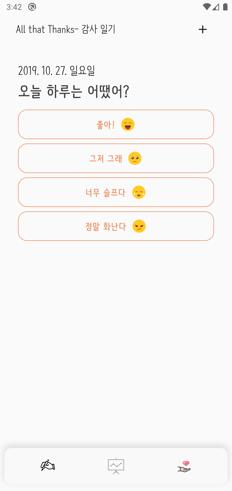

# 

The app takes flight with Flutter.

# Overview

Intelligent Journal Application, which helps you to memory precious daily memories, such as the moments when receiving help.

이 애플리케이션은 2019년 강원고등학교 동아리 `드림하이` 의 프로젝트 중 하나로 개발되었습니다.

